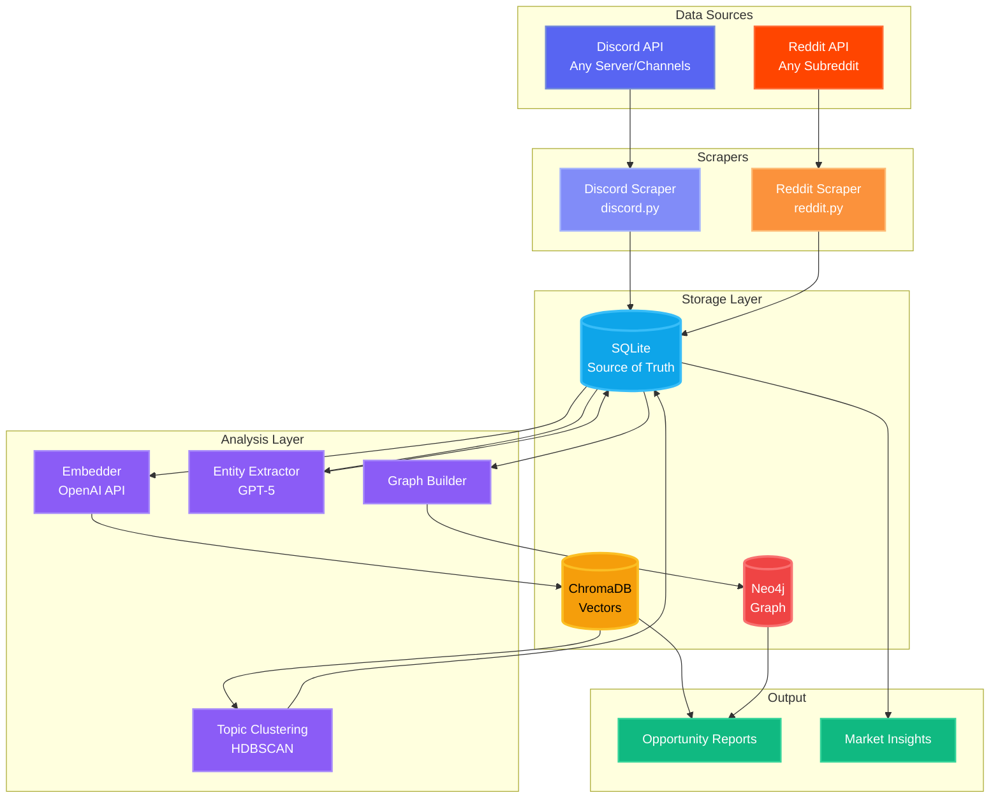
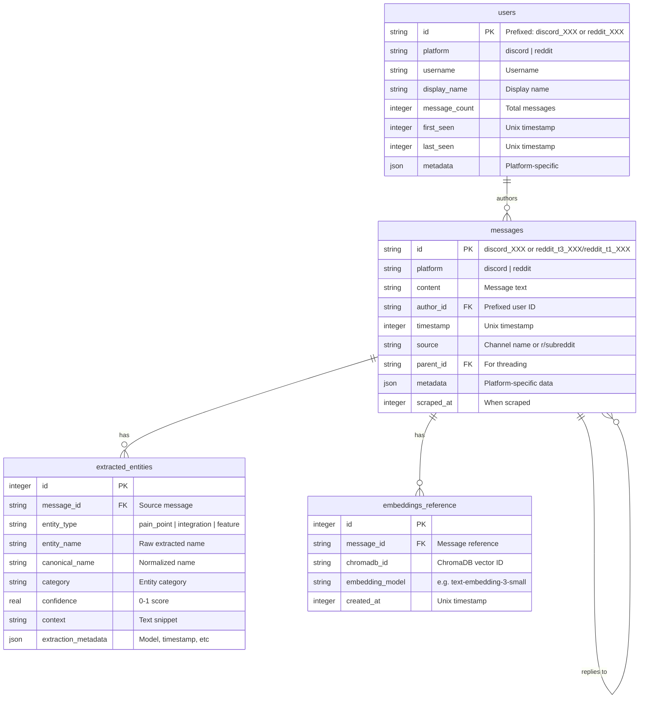
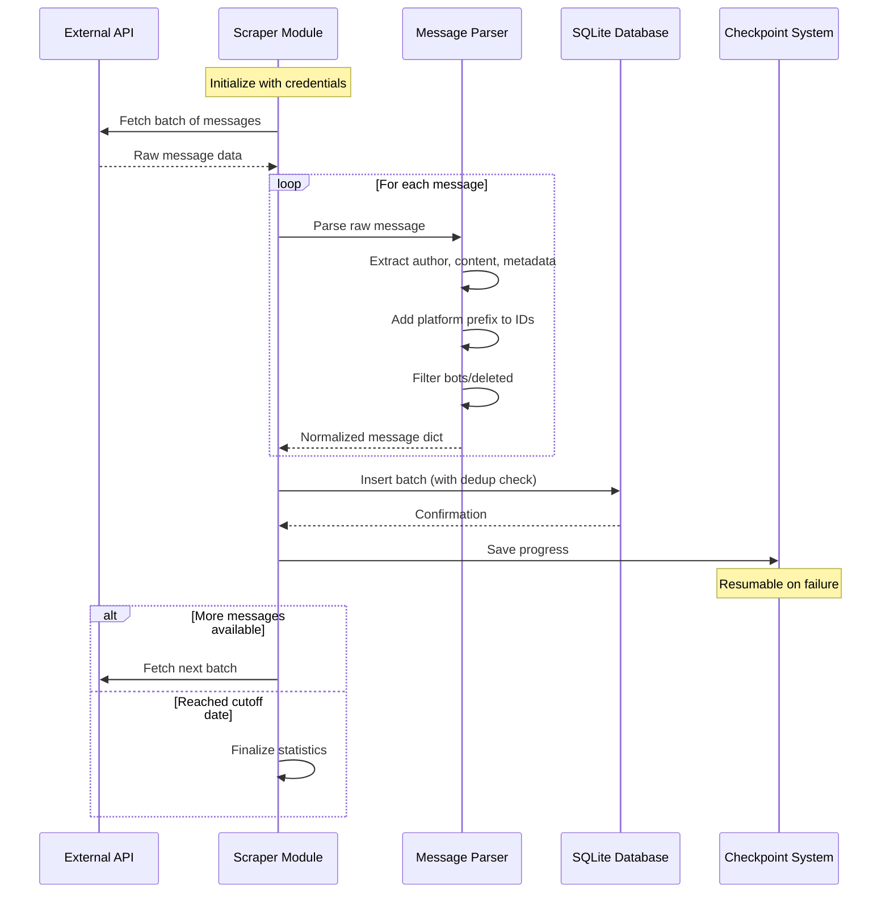
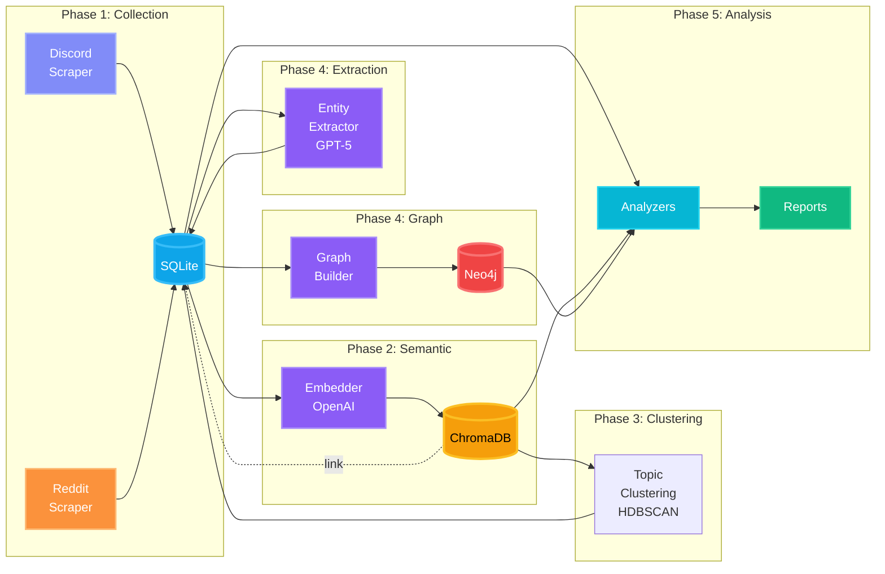

<div align="center">

# 🎯 Discredit

### *Discord and Reddit Community Intelligence Mining for Market Discovery*

**Extract actionable insights from Discord servers and Reddit communities**

[](https://python.org)
[](https://python-poetry.org)
[](https://sqlite.org)
[](https://neo4j.com)
[](https://openai.com)

---

</div>

## 📖 Overview

Discredit is a **community intelligence mining system** that analyzes conversations from any Discord server and Reddit community to identify pain points, feature requests, and integration opportunities. By processing thousands of real user conversations, it surfaces actionable insights backed by actual demand data.

## ✨ Features

- 🔄 **Automated Scraping**: Collect messages from Discord channels and Reddit with full comment tree traversal
- 🗄️ **Unified Database**: Single source of truth normalizing Discord and Reddit data with smart ID prefixing
- 🧠 **Semantic Search**: Vector embeddings for finding similar pain points and requests
- 🔬 **Topic Clustering**: HDBSCAN automatically discovers natural topic groupings from embeddings
- 🕸️ **Graph Analysis**: Relationship mapping to identify patterns and communities
- 🤖 **AI-Powered Extraction**: GPT-5 extracts pain points, integrations, and features from conversations
- 📊 **Opportunity Reports**: Data-driven insights with user quotes and frequency metrics
- ⚡ **Production Ready**: Rate limiting, checkpointing, and resumable scraping

## 🏗️ Architecture

### 🔍 Overview

Discredit uses a **multi-database architecture** to handle different aspects of data analysis:

- 🗄️ **SQLite**: Source of truth for all scraped messages, users, and extracted entities
- 🧠 **ChromaDB**: Vector embeddings for semantic search and clustering
- 🕸️ **Neo4j**: Graph database for relationship analysis and pattern discovery
- 🐍 **Python 3.13** with **Poetry** for dependency management



### 💾 Database Architecture

#### 📊 SQLite Schema

SQLite serves as the **single source of truth** with a unified table design that normalizes both Discord and Reddit data:



**🎯 Key Design Decisions:**

1. 🔗 **Unified Messages Table**: Single table for Discord and Reddit with `platform` column
2. 🏷️ **ID Prefixing**: Prevents collisions (`discord_123`, `reddit_t3_abc`, `reddit_t1_xyz`)
3. 📝 **Type Prefixes for Reddit**: `t3_` = posts, `t1_` = comments
4. 🧵 **Parent-Child Threading**: `parent_id` field supports Discord replies and Reddit comment trees
5. 📦 **JSON Metadata**: Platform-specific fields (reactions, upvotes, awards) stored as JSON
6. ⚡ **No ORM**: Raw SQL for performance and transparency

### ⚙️ Application Architecture

#### 🤖 Scraper Architecture

Both scrapers follow a common pattern: fetch → parse → normalize → store with deduplication.



**💬 Discord Scraper (`scrapers/discord.py`):**
- 🌐 Uses Discord API v10 (HTTP/REST)
- 📄 Pagination via `before` parameter
- ⏱️ Rate limiting: 5 req/sec with exponential backoff
- 💾 Checkpoint every 1000 messages
- 🚫 Filters: bots, empty messages
- 🏷️ Prefixes: `discord_MESSAGEID`, `discord_USERID`

**🔴 Reddit Scraper (`scrapers/reddit.py`):**
- 🔧 Uses PRAW (Python Reddit API Wrapper)
- 🌲 Fetches posts with full comment trees
- ♾️ No depth limit on comment traversal
- 🚫 Filters: bots, mods, deleted/removed content
- 🏷️ Prefixes: `reddit_t3_POSTID` (posts), `reddit_t1_COMMENTID` (comments)
- ⏱️ Rate limiting: 0.5s between requests

#### 📊 Data Flow



**🔄 Pipeline Stages:**

1. 📥 **Collection**: Scrapers → SQLite (unified storage)
2. 🧠 **Semantic Processing**: SQLite → OpenAI → ChromaDB (vector embeddings)
3. 🔍 **Entity Extraction**: SQLite → GPT-4 → SQLite (pain points, integrations, features)
4. 🕸️ **Graph Construction**: SQLite → Neo4j (relationships, communities, patterns)
5. 📊 **Analysis**: Multi-database queries → Opportunity reports

---

## 📁 Project Structure

```
discredit/
├── backend/
│   ├── scrapers/       # Discord and Reddit scraping modules
│   ├── storage/        # Database wrapper modules (SQLite, ChromaDB, Neo4j)
│   ├── analysis/       # Embedding and entity extraction logic
│   ├── queries/        # Cypher queries and analysis scripts
│   ├── scripts/        # Runnable entry points
│   ├── data/           # All database files (gitignored)
│   ├── reports/        # Generated analysis reports (gitignored)
│   ├── config.py       # Centralized configuration
│   ├── .env            # Environment variables and secrets (gitignored)
│   └── pyproject.toml  # Poetry dependencies
├── .project/           # Project documentation and planning
└── README.md           # This file
```

## 🚀 Setup

### 1️⃣ Install Poetry (if not already installed)

```bash
curl -sSL https://install.python-poetry.org | python3 -
```

### 2️⃣ Install Dependencies

```bash
cd backend
poetry install
```

### 3️⃣ Configure Environment Variables

Edit `backend/.env` with your credentials and target communities:

- 💬 **Discord**: Auth token, server ID, channel IDs (your target server)
- 🔴 **Reddit**: Client ID, client secret, user agent, subreddit name (your target community)
- 🤖 **OpenAI**: API key for embeddings and extraction
- 🕸️ **Neo4j**: Connection URI, username, password

**Example `.env`:**
```bash
# Discord
DISCORD_AUTH_TOKEN=your_token_here
DISCORD_SERVER_ID=123456789
DISCORD_CHANNEL_ID=987654321

# Reddit
REDDIT_CLIENT_ID=your_client_id
REDDIT_CLIENT_SECRET=your_secret
REDDIT_USER_AGENT=Discredit/1.0
REDDIT_SUBREDDIT=python  # Change to your target subreddit

# OpenAI
OPENAI_API_KEY=sk-...

# Neo4j
NEO4J_URI=bolt://localhost:7687
NEO4J_USERNAME=neo4j
NEO4J_PASSWORD=your_password
```

### 4️⃣ Activate Poetry Shell

```bash
poetry shell
```

---

## 💻 Usage

Run scripts from the `backend/` directory using Poetry:

```bash
# Test all API credentials
poetry run python scripts/test_credentials.py

# Light test of Discord scraper (10 messages)
poetry run python scripts/test_discord_scraper_light.py

# Light test of Reddit scraper (3 posts)
poetry run python scripts/test_reddit_scraper_light.py

# Run full Discord scraper
poetry run python scrapers/discord.py

# Run full Reddit scraper
poetry run python scrapers/reddit.py
```

---

## 🛠️ Development

- 📂 All backend code lives in `backend/`
- 📦 Use `poetry add <package>` to add new dependencies
- 🐚 Use `poetry shell` to activate the virtual environment
- ⚙️ Configuration is managed through `backend/config.py`

---

## 🎯 Use Cases

- **Market Research**: Identify pain points and feature requests in your target community
- **Product Development**: Discover what users actually want based on real conversations
- **Competitive Intelligence**: Understand integration needs and workflow patterns
- **Community Analysis**: Track sentiment, engagement, and emerging trends
- **SaaS Opportunity Discovery**: Find high-value problems worth solving

**Output**: Actionable reports backed by real user quotes, frequency analysis, and demand metrics

